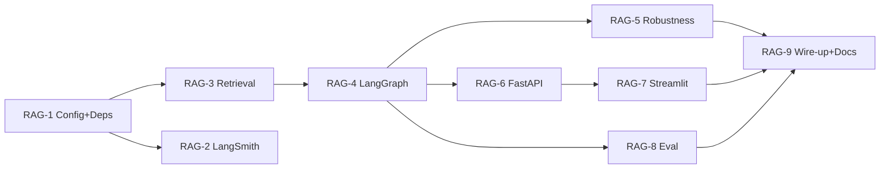

# RAG Upgrade — Jira Backlog

Jira-style tickets to execute [RAG_UPGRADE_PLAN.md](RAG_UPGRADE_PLAN.md).

- **Project key:** `RAG`
- **Epic:** `RAG-0`
- **Estimation:** story points (Fibonacci 1/2/3/5/8)
- **Labels:** `rag`, `langgraph`, `langsmith`, `retrieval`, `api`, `eval`, `infra`

---

## EPIC — RAG-0: Robust, observable RAG service (LangGraph + LangSmith)

**Summary:** Turn the current linear RAG script into a graph-orchestrated, observable,
production-shaped RAG service with hybrid retrieval, reranking, conversation memory,
a FastAPI + Streamlit interface, and a LangSmith evaluation harness.

**Business value:** Higher answer quality and trust (citations, grounding), faster
debugging (traces), measurable quality (eval), and a usable interface.

**Definition of done (epic):**
- A user can chat via Streamlit and get grounded answers with citations.
- Every request produces a LangSmith trace.
- Eval suite runs and reports ragas metrics.
- README documents setup and run for API, UI, and eval.

**Child stories:** RAG-1 … RAG-9

---

## RAG-1 — Configuration & dependency setup

- **Type:** Story
- **Points:** 3
- **Priority:** Highest
- **Labels:** `infra`
- **Depends on:** —
- **Blocks:** RAG-2, RAG-3

**Description**
Centralize all settings and install the new libraries so later tickets have a stable
foundation. Today values are hardcoded across `app.py`, `src/search.py`, and
`src/vector_store.py` (model names, top_k, chunk params, paths).

**Tasks**
- Add `src/config.py` using `pydantic-settings` with: embedding model, reranker model,
  Groq model name, `top_k`, `chunk_size`, `chunk_overlap`, `persist_dir`,
  `GROQ_API_KEY`, `LANGSMITH_TRACING`, `LANGSMITH_API_KEY`, `LANGSMITH_PROJECT`.
- Add deps to `pyproject.toml` + `requirements.txt`: `langgraph`, `langsmith`,
  `rank-bm25`, `fastapi`, `uvicorn[standard]`, `streamlit`, `pydantic-settings`,
  `ragas`, `pytest`.
- Update `.env.example` with the LangSmith keys.
- Run `uv sync` (or `pip install -r requirements.txt`) and confirm a clean install.

**Acceptance criteria**
- `from src.config import settings` returns populated values from `.env`.
- Missing `GROQ_API_KEY` raises a clear, early error.
- `uv sync` completes with no dependency conflicts.

---

## RAG-2 — LangSmith tracing integration

- **Type:** Story
- **Points:** 2
- **Priority:** High
- **Labels:** `langsmith`
- **Depends on:** RAG-1
- **Blocks:** —

**Description**
Make every run observable. LangChain/LangGraph runnables auto-trace from env vars;
custom functions need explicit instrumentation.

**Tasks**
- Document/set env vars: `LANGSMITH_TRACING=true`, `LANGSMITH_API_KEY`,
  `LANGSMITH_PROJECT=rag-pro`.
- Decorate custom functions with `@traceable` from `langsmith`: embedding generation
  (`src/embedding.py`), FAISS search (`src/vector_store.py`), rerank (`src/retriever.py`).
- Add run metadata (query, top_k) to traces for easier filtering.

**Acceptance criteria**
- Running a query creates a trace tree in LangSmith showing rewrite → retrieve →
  rerank → generate spans.
- Custom (non-LangChain) steps appear as their own spans.
- Tracing can be disabled by setting `LANGSMITH_TRACING=false` with no code change.

---

## RAG-3 — Retrieval quality: cosine + hybrid + rerank

- **Type:** Story
- **Points:** 8
- **Priority:** Highest
- **Labels:** `retrieval`
- **Depends on:** RAG-1
- **Blocks:** RAG-4

**Description**
Improve candidate quality before generation. Today `src/vector_store.py` uses
`IndexFlatL2` on un-normalized vectors and metadata is only `{"text": ...}`.

**Tasks**
- Switch FAISS to cosine: L2-normalize embeddings, use `IndexFlatIP`.
- Enrich metadata: `source`, `page`, `chunk_id`, `text`.
- Create `src/retriever.py` with `HybridRetriever` combining dense (FAISS) +
  keyword (`rank-bm25`) results via Reciprocal Rank Fusion.
- Add cross-encoder reranking (`cross-encoder/ms-marco-MiniLM-L-6-v2`); return final top_k.
- Provide a one-time reindex path (rebuild `faiss_store/`).

**Acceptance criteria**
- Index built with `IndexFlatIP` and normalized vectors.
- `HybridRetriever.retrieve(query, k)` returns reranked chunks each carrying source metadata.
- A keyword-heavy query that previously missed now returns the correct chunk (manual spot check).

**Notes / risk**
- Requires re-embedding the corpus once after switching to cosine.

---

## RAG-4 — LangGraph orchestration with memory

- **Type:** Story
- **Points:** 8
- **Priority:** Highest
- **Labels:** `langgraph`
- **Depends on:** RAG-3
- **Blocks:** RAG-5, RAG-6, RAG-8

**Description**
Replace the linear `RAGSearch.search_and_summarize` with an extensible graph that
supports branching and conversation memory.

**Tasks**
- Create `src/graph.py` with a `TypedDict` state: `question`, `chat_history`,
  `rewritten_query`, `documents`, `answer`, `citations`.
- Nodes: `rewrite_query`, `hybrid_retrieve`, `rerank`, `grade_relevance`,
  `generate_answer`, `attach_citations`.
- Conditional edge from `grade_relevance` → `generate_answer` (relevant) or
  `fallback` (weak).
- Compile with `MemorySaver` checkpointer keyed by `thread_id`.

**Acceptance criteria**
- `graph.invoke({"question": ...}, config={"configurable": {"thread_id": "t1"}})`
  returns `{answer, citations}`.
- A follow-up question on the same `thread_id` correctly uses prior context
  (resolves pronouns via `rewrite_query`).
- Weak-relevance queries route to the fallback node.

---

## RAG-5 — Robustness & anti-hallucination

- **Type:** Story
- **Points:** 5
- **Priority:** High
- **Labels:** `langgraph`
- **Depends on:** RAG-4
- **Blocks:** RAG-9

**Description**
Reduce crashes and hallucinations; return structured output. Today the LLM uses a
loose "summarize" prompt and returns `"No relevant documents found"` as a bare string.

**Tasks**
- Add retry/backoff + timeout around Groq LLM calls.
- Replace the summarize prompt with a strict grounded QA prompt (answer only from
  context; say "I don't know" when unsupported).
- Return structured result `{answer, citations, used_context}`.
- Harden the load/build path: skip unreadable files, log counts, fail only on total failure.

**Acceptance criteria**
- A question with no relevant context returns a graceful fallback (not an exception).
- A transient LLM error is retried and recovers.
- Output is always the structured object with citations populated when context is used.

---

## RAG-6 — FastAPI service

- **Type:** Story
- **Points:** 5
- **Priority:** High
- **Labels:** `api`
- **Depends on:** RAG-4
- **Blocks:** RAG-7

**Description**
Expose the graph over HTTP.

**Tasks**
- Create `api/main.py` (FastAPI) with:
  - `POST /chat` — body `{question, thread_id}` → `{answer, citations}`.
  - `POST /ingest` — (re)build the index.
  - `GET /health` — liveness check.
- Add Pydantic request/response models.
- Document run command: `uvicorn api.main:app --reload`.

**Acceptance criteria**
- `GET /health` returns 200.
- `POST /chat` returns a grounded answer + citations for a known question.
- `POST /ingest` rebuilds the index and reports counts.
- Invalid request bodies return 422 with clear errors.

---

## RAG-7 — Streamlit chat UI

- **Type:** Story
- **Points:** 3
- **Priority:** Medium
- **Labels:** `api`
- **Depends on:** RAG-6
- **Blocks:** RAG-9

**Description**
A simple browser chat client over the FastAPI endpoint.

**Tasks**
- Create `ui/streamlit_app.py`: chat input + message history.
- Call `POST /chat`; persist a per-session `thread_id`.
- Render answers and expandable source citations.

**Acceptance criteria**
- User can hold a multi-turn conversation in the browser.
- Each answer shows expandable sources with metadata.
- Session memory persists within a browser session.

---

## RAG-8 — Evaluation harness (ragas + LangSmith)

- **Type:** Story
- **Points:** 5
- **Priority:** Medium
- **Labels:** `eval`
- **Depends on:** RAG-4
- **Blocks:** RAG-9

**Description**
Measure quality and enable before/after comparisons.

**Tasks**
- Build a small LangSmith dataset (question / expected-answer pairs from your docs).
- Create `eval/run_eval.py` to run the graph over the dataset.
- Score with ragas: faithfulness, answer relevancy, context precision/recall.
- Log results to LangSmith.

**Acceptance criteria**
- `python eval/run_eval.py` produces per-metric scores.
- Results are visible in LangSmith and reproducible across runs.
- Changing retrieval params produces a comparable score delta.

---

## RAG-9 — Wire-up & documentation

- **Type:** Story
- **Points:** 3
- **Priority:** Medium
- **Labels:** `infra`
- **Depends on:** RAG-5, RAG-7, RAG-8
- **Blocks:** —

**Description**
Final integration and docs so anyone can run the system.

**Tasks**
- Slim `app.py` into a thin CLI that builds/loads the index and invokes the graph.
- Update `README.md`: new architecture diagram, LangSmith setup, run instructions for
  API, Streamlit, and eval.
- Add a short troubleshooting section (missing keys, reindex after cosine switch).

**Acceptance criteria**
- A new developer can clone, set keys, and run API + UI from the README alone.
- `app.py` runs an example query through the graph end-to-end.
- README reflects the final architecture.

---

## Sprint suggestion

- **Sprint 1 (foundation):** RAG-1, RAG-3, RAG-4 — core pipeline working.
- **Sprint 2 (quality + access):** RAG-2, RAG-5, RAG-6, RAG-7.
- **Sprint 3 (measure + ship):** RAG-8, RAG-9.

**Total:** 9 stories · 42 points.
