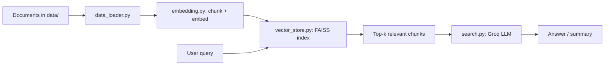

# RAG

A Retrieval-Augmented Generation (RAG) pipeline in Python: load your own documents, embed them, store the vectors in FAISS, and answer questions with a Groq-hosted LLM.

## Features

- Load PDF, text, and CSV files from a `data/` folder (via LangChain loaders)
- Chunk documents with `RecursiveCharacterTextSplitter`
- Generate embeddings with `sentence-transformers` (`all-MiniLM-L6-v2`)
- Store and search vectors with FAISS
- Summarize retrieved context with a Groq LLM (`llama-3.3-70b-versatile`)

## Tech stack

LangChain - sentence-transformers - FAISS - ChromaDB - Groq - python-dotenv

## Project structure

```
RAG_PRO/
├── app.py                 # Entry point: build store, query, summarize
├── src/
│   ├── data_loader.py     # Load PDF/TXT/CSV into LangChain documents
│   ├── embedding.py       # Chunk documents and create embeddings
│   ├── vector_store.py    # FAISS index: build, save, load, query
│   └── search.py          # RAGSearch: retrieve context + Groq LLM
├── data/                  # Your source documents (PDF/TXT/CSV)
├── notebook/              # Exploratory notebooks
├── requirements.txt
└── pyproject.toml
```

## How it works



## Setup

This project uses [uv](https://github.com/astral-sh/uv).

```bash
# Install dependencies
uv sync

# Or with pip
pip install -r requirements.txt
```

### Environment variables

Copy the example file and add your Groq API key (get one at https://console.groq.com/keys):

```bash
cp .env.example .env
```

Then edit `.env`:

```
GROQ_API_KEY=your_key_here
```

## Usage

1. Put your documents in the `data/` folder (PDF, TXT, or CSV).
2. Run the pipeline:

```bash
uv run python app.py
```

`app.py` builds the FAISS store from your documents on the first run, then reuses the saved index on later runs, and prints an LLM-generated summary. Edit the `query` variable in `app.py` to ask your own questions.

## Notes

- The FAISS index is saved to `faiss_store/` and is git-ignored (regenerated locally).
- Never commit your `.env` — it holds your API key and is already in `.gitignore`.
